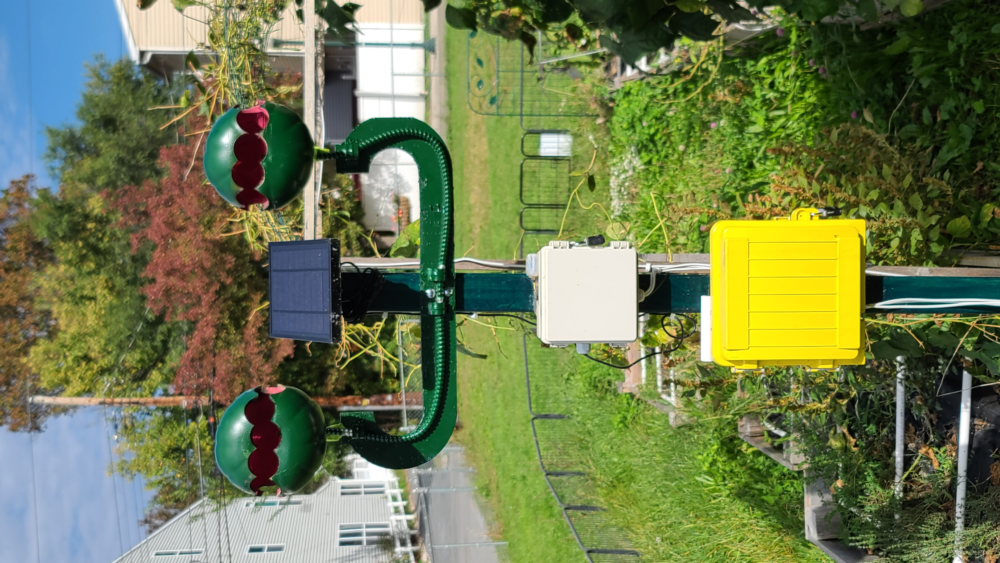

# GardenBrain
This is the GardenBrain smart garden repository. Gardenbrain is a solar powered Raspberry Pico based device.
The solar panel charges 4 16850 batteries. 

The goal of GardenBrain is to leverage various IoT sensors to determine the following:

* Wet/Dry conditions of various garden beds
* Measure temperature and humidity (inside the control box)
* Measure outdoor temperature and humidity
* Measure battery voltage of the 16850 batteries
* Measure for light (to determine day/night sunrise/sunset)
* more...

The system works as follows:

* System powers on.
* Raspberry pico w flashes onboard LED to indicate that it is attempting to connect to home wifi (a secure VLAN for outdoor usage)
* Once connected, the GardenBrain "eyes", mouths, or whatever they are flash RGB LEDs 
* The pico pulls time via NTP once connected.
* The system registers the GardenBrainV2 API handler
* The sytem starts the mqtt thread, which polls sensors and sends an MQTT report to the mothership.
* The system then triggers the TPL5110 low power timer to turn off for appx 9 minutes.
* After the 9 minute timer the system starts again from the beginning.

| Image |
| :---:   |
| [Image of GardenBrain](./images/20231012_142758.jpg)|
| [GardenBrain blinking](./images/20231018_184133_1.mp4)  |
| [The internals of the brain box](./images/20231017_141417.jpg)|
| [The GPIOs](./gpios-led.png)|
